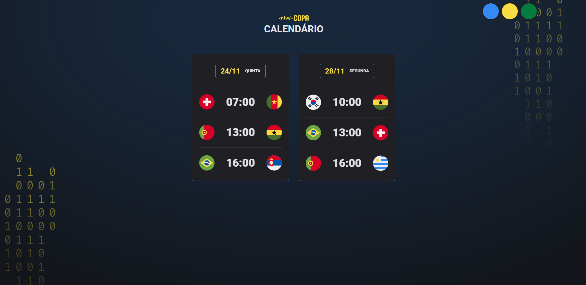
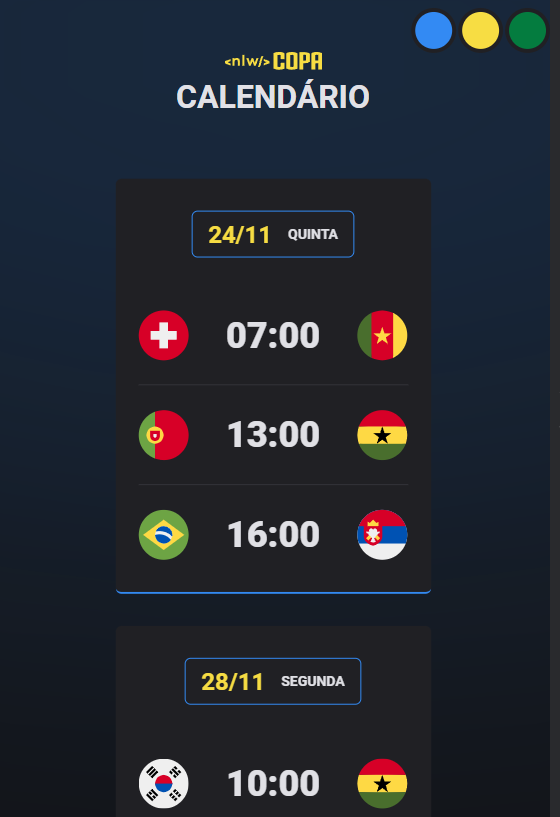

<h3 align = "center" fontSize="200px">
  Projeto Explorer NLW da copa
</h3>

  

## :rocket: Tecnologias

- [Html](https://developer.mozilla.org/pt-BR/docs/Web/HTML/Element/html/)  
- [CSS](https://developer.mozilla.org/pt-BR/docs/Web/CSS)  
- [JavaScript](https://developer.mozilla.org/pt-BR/docs/Web/JavaScript) 

## 💻 Projeto

Projeto feito na semana NLW copa, trilha explorer pra melhorar e aperfeçoar as skills nas tecnologias basicas prensentes na programação Web no front-end.

  

